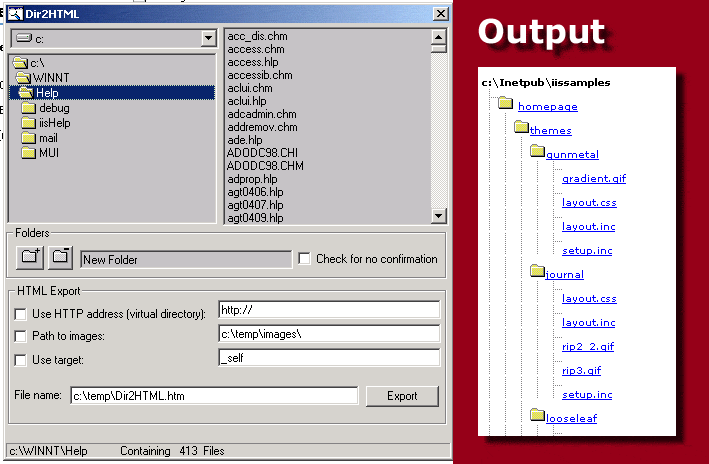



## Dir2HTML

### Description

Dir2HTML allows you to browse your directories and export the directory (and everything below) of your choice to an HTML page. This application is particularly helpful if you want to make a sitemap of an intranet or internet site. You can specify the name of the virtual directory, the target (if you want to use the page in a frame), and the location of the image files.
 
### More Info
 
Input is the directory of your choice.

The code is a typical example of a recursive function and the use of the VB common controls to browse disks and files.

Output is a web page with absolute or relative hyperlinks, both to folders and to files

             |
---                |---
**Submitted On**   |2001-03-01 17:06:26
**By**             |[Frodooo](https://github.com/Planet-Source-Code/PSCIndex/blob/master/ByAuthor/frodooo.md)
**Level**          |Intermediate
**User Rating**    |4.8 (24 globes from 5 users)
**Compatibility**  |VB 6\.0
**Category**       |[Internet/ HTML](https://github.com/Planet-Source-Code/PSCIndex/blob/master/ByCategory/internet-html__1-34.md)
**World**          |[Visual Basic](https://github.com/Planet-Source-Code/PSCIndex/blob/master/ByWorld/visual-basic.md)
**Archive File**   |[CODE\_UPLOAD15686322001\.zip](https://github.com/Planet-Source-Code/frodooo-dir2html__1-21444/archive/master.zip)

